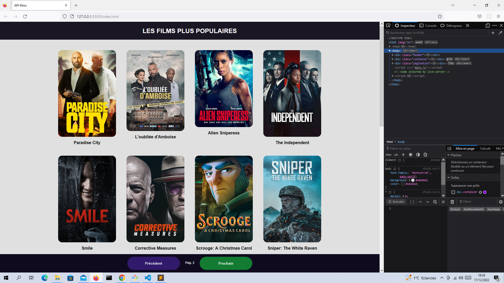

# ***Consommer l'API avec js***
[TOC]

## ***Introduction***
Il s'agit d'une pratique pour apprendre à consommer les données d'une API.
- L'API utilisée est TMDB

## ***Resources used:***
- Visual Studio Code (Editor)
- https://www.themoviedb.org
- https://developer.mozilla.org

## ***Languages used:***
- Html
- JavaScript
- Css

## ***Directory***
		/images/
			img00.png
		/index.html
		/main.js
		/style.css
		/README.md

   
## ***Screenshots***

## ***Notes:***
This practice is carried out only with the objective of learning to consume data from an API